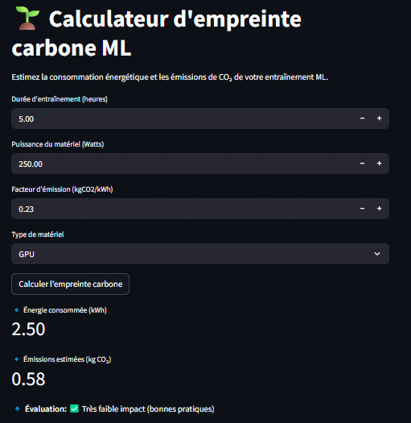

# 🌱 ML Carbon Footprint Calculator (Streamlit App)


Application web interactive développée avec **Python** et **Streamlit** permettant d’estimer la **consommation énergétique** et l’**empreinte carbone (CO₂)** d’un entraînement de modèles de **Machine Learning**.

Ce projet s’inscrit dans une démarche de **Green AI**, visant à sensibiliser les étudiants et développeurs à l’impact environnemental du calcul intensif.

---

## Demo

Application en ligne (Streamlit Cloud) :  
**https://YOUR-APP.streamlit.app**  


---

##  Description

L’entraînement des modèles de Machine Learning peut être coûteux en énergie, en particulier lors de l’utilisation de GPU.  
Cette application permet de :

- Estimer l’énergie consommée (en kWh)
- Estimer les émissions de CO₂ correspondantes (en kg)
- Fournir une **évaluation qualitative** de l’impact environnemental et une **recommandation**

---

## Fonctionnalités

###  Entrées interactives
- Durée d’entraînement (en heures)
- Puissance du matériel (en Watts)
- Facteur d’émission carbone (kg CO₂ / kWh)
- Type de matériel (CPU ou GPU)
  

###  Résultats affichés
- Énergie consommée (kWh)
- Émissions estimées de CO₂ (kg)
- Évaluation de l’impact (Très faible ou modéré ou élevé ou très élevé) environnemental et recommendation :

---

## Exemple d’utilisation

**Paramètres :**
- Durée : 5 heures  
- Puissance : 250 W  
- Matériel : GPU  
- Facteur d’émission : 0.233 kg CO₂ / kWh  

**Résultats estimés :**
- Énergie consommée : 2.50 kWh  
- Émissions de CO₂ : ~0.58 kg  
- Impact : Très faible impact (bonnes pratiques)

---

##  Installation locale

### Prérequis
- Python 3.9 ou plus
- Streamlit
- pip

### Étapes


```bash
git clone https://github.com/Juleshounsavi/App-web-Projet-Captsone-GDS.git
cd App-web-Projet-Captsone-GDS
pip install -r requirements.txt
streamlit run app.py




